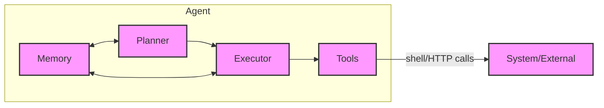
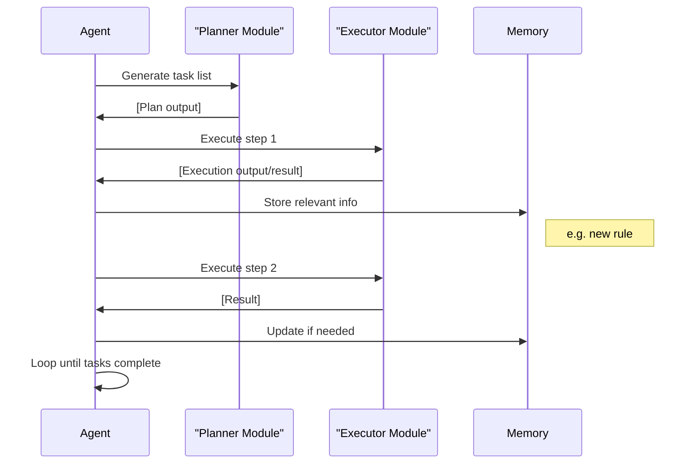

# AGENTS.md for Vision (Repository-Specific Agent Guide)

**Executive Summary:** This document serves as the *operating manual* for AI agents working on the Vision repository. It defines how agents should initialize, plan tasks, execute actions, and use memory and tools in this codebase. We outline a startup protocol (which files and configs to load), the agent architecture (planner, executor, memory, tools), a precise memory model (paths, formats, retention, promotion of notes), a tooling spec (SKILL.md conventions and example mappings to repo scripts), and strict action boundaries. We also specify session rules, safety/privacy guardrails, and workflows (plan→execute→log cycles, CI checks, entry points). Finally, maintenance guidelines cover memory updates, refactoring triggers, and key metrics. This AGENTS.md tailors best practices (e.g. OpenClaw/Context Engineering) to Vision’s structure and will guide developer agents step-by-step【61†L71-L74】【57†L134-L139】.

## Startup Protocol
- **Environment Prep:** Use Python 3.14+ and install dependencies:
  ```bash
  python -m pip install -r requirements.txt  # core requirements
  python -m pip install -e ".[dev]"         # development extras (linters, tests)
  ```
- **Read Core Documentation:** Agents should first load repository-wide guides (in order):
  1. `.github/copilot-instructions.md` – custom instructions for Copilot/agents.
  2. `AGENTS.md` – this file, for agent behavior and workflows.
  3. `DOCUMENTATION_INDEX.md` – high-level documentation index.
  4. `README.md` – project overview and quick start.
- **Configuration Files:** Check `.env` for API keys (ElevenLabs, OpenAI, etc.) and `vision_automation_state.json` for automation state.
- **Launch Vision (Recommended):** Use the unified launcher:
  ```powershell
  # Windows (PowerShell as Administrator):
  .\vision_master_launcher.ps1

  # Or manually start components:
  python live_chat_app.py        # Backend API + WebSocket
  # Then open: live_chat_ui.html   # Primary UI
  # And: vision_command_center.html  # Command Center dashboard
  ```
- **Alternative Launchers:**
  - `launch_vision.ps1` – Legacy launcher with Ollama management
  - `vision_elite_launcher.ps1` – Elite features launcher
- **Verification:** Run health checks:
  ```powershell
  # Check Vision health
  Invoke-RestMethod -Uri http://localhost:8765/api/health

  # Run tests
  python test_tools.py
  python test_vision.py
  ```
- **MCP Servers:** Vision exposes MCP endpoints for external integration:
  - Local: `http://localhost:8765/mcp`
  - Configure in VS Code: `vscode-userdata:/.../mcp.json`

## Agent Architecture
Agents in this system follow a **planner-executor-memory-tools** model:
- **Planner** – devises step-by-step plans or task lists (e.g. writing numbered task lists or TODOs in markdown). Example format:
  ```markdown
  - **Step 1:** Analyze code structure (existing classes, files).
  - **Step 2:** Identify module to modify or create new.
  - **Step 3:** Write or update code; then write tests; then commit changes.
  ```
- **Executor** – performs actions from the plan, such as running code editing operations, shell commands, or file I/O. Its outputs are concrete actions/logs, for example logging the results of a `pytest` run or producing a diff patch. Example: a tool invocation might output:
  ```
  Running tests...
  24 passed, 0 failed.
  ```
- **Memory** – tracks persistent state and knowledge (see Memory Model below). Agents query memory for previous context (e.g. project conventions) and write back learnings or decisions. Outputs here include updated memory entries or logs.
- **Tools** – external utilities or scripts the agent can invoke. In Vision, tools include functions for TTS (`speak.py`), voice toggling (`voice_toggle.py`), OCR, RAG queries, etc. Each tool is defined by a SKILL (see next section) and has associated metadata (name, description, etc.). Example tools in this repo include the voice toggle and OCR scripts; an agent might call them with JSON arguments and receive responses.

Below is a high-level system architecture diagram illustrating these roles:



*Figure: Agent architecture (Planner ↔ Memory ↔ Executor, using Tools)*.

**Agent Roles Comparison:** Below is a summary of principal agent roles (generic) and their context in the Vision repo, including where their specs or code live and what approval each action requires.

| Agent Role      | Responsibility                          | Spec/Code Location                      | Approval Required                 |
|-----------------|-----------------------------------------|-----------------------------------------|-----------------------------------|
| **Planner**     | Creates task breakdowns (To-Do lists)   | Guidance in `AGENTS.md` (this file)     | **Yes** for major changes         |
| **Executor**    | Implements plan steps (editing, tests)  | Operates via `live_chat_app.py` & tools | **Yes** before critical ops (commits) |
| **Memory**      | Stores knowledge across sessions        | `memory.json`, `chat_events.log`【32†L849-L852】 | No (auto-managed)                 |
| **Tools Manager** | Invokes external tools/scripts        | `.github/skills/` SKILL.md definitions  | No (but skill additions need review) |

Each role handoff should produce clear outputs (plans as lists, execution results as logs or diffs, memory writes as JSON entries).

## Memory Model
Vision’s memory is two-tier:

- **Daily/Session Logs:** `chat_events.log` (in repo root) captures the full event log of conversations and actions【32†L849-L852】. Agents treat this as a write-only log of recent interactions. It grows indefinitely but can be rotated or truncated if needed. (Currently Vision does not auto-split by date; treat it as one sequential log.)
- **Long-term Memory:** `memory.json` stores persistent “facts” (preferences, tasks, notes)【32†L849-L852】. This JSON file is auto-created and retains content between runs. It should be updated only when needed (e.g. writing key decisions, fixes, user preferences). Deleting `memory.json` resets the memory.

*Formats:* Both files are JSON/text. On disk, `memory.json` follows Vision’s custom schema (keys like “fact”, “preferences” etc.), while logs are plain text.

*Retention:* Memory is essentially permanent unless manually purged. No automatic expiry is defined. Key rules for durability:
  - **Durable Rules in Files:** As a rule, hardcoded rules or stable guidelines belong in permanent files (like this AGENTS.md or SOUL.md if used), **not** in ephemeral chat history【27†L58-L64】. For example, repository conventions should be documented here, not left in memory cache.
  - **Memory Writes on Flush:** Ensure the memory flush feature (in Vision’s config) is enabled before context compression【27†L58-L64】. The system will auto-save important context to `memory.json`.
  - **Promotion Workflow:** At session end or periodically (e.g. daily), summarize decisions into `memory.json`. Unstructured “raw” notes can be appended to a daily-log file (if implemented) and later distilled. Following best practice, one should weekly review the logs and **promote durable insights into `memory.json` or a `MEMORY.md`** cheat-sheet【82†L72-L76】. For example, if the agent learns a new workflow step, add it to memory with a timestamp and context. Over time, prune trivial entries: keep `memory.json` short (ideally <100 entries) as a quick reference【82†L72-L76】.
  - **Memory Access:** Agents should *always* search memory for relevant facts before proceeding (VelvetShark Rule 3)【27†L58-L64】. For example, if a user preference was noted previously, the agent should recall it from `memory.json`.

## Tooling Spec (Skills and Logging)
**SKILL.md Definition:** Each tool or capability is defined in its own directory under `.github/skills/`. A valid SKILL has a frontmatter and a body【66†L303-L310】. Shared local skills are also available at `C:\project\skills`.
- **Frontmatter (YAML):**
  ```yaml
  ---
  name: vision-ocr
  description: 'OCR image text. Use when given a path or image data to extract text via Tesseract.'
  license: 'Complete terms in LICENSE.txt'
  ---
  ```
  *Fields:* `name` (lowercase, hyphenated), `description` (detailed capabilities and triggers)【66†L312-L319】, and optional `license`.
- **Description:** Must clearly state what the tool does **and when to use it**【66†L324-L332】. E.g., “Vision speech tool: use when user inputs text to be spoken aloud.”
- **Body Content:** Contains sections like `## When to Use This Skill`, `## Step-by-Step Workflows`, `## Gotchas` etc【66†L349-L358】【66†L400-L409】. These act as in-context instructions for the agent when the skill is activated.

**Tool Files:** A skill folder may include subfolders:
- `scripts/`: executable scripts (Python, PowerShell, etc.) that perform tasks. *Example:* `vision-mcp-tools` might have a `scripts/generate_mcp.sh`.
- `references/`: documentation or data to load into context (only when referenced).
- `templates/` or `assets/`: starter code or static files as needed.

**Usage Logging:** When an agent invokes a tool, it should log the call and its result in `chat_events.log` for traceability. *Example:* If calling the `speak.py` tool, the agent logs the command and captures any output or errors.

**Mapping to Repo:** Vision’s actual tools include:
- `voice/voice_toggle.py`, `voice/speak.py` (text-to-speech toggling).
- `hive_tools/context_mapper.py` (context building tool).
- RAG tools under `vision_rag/`.
- Any custom scripts (e.g. `vision_mcp_server.py`).
Each of these should have a corresponding SKILL.md in `.github/skills/vision-*` describing its interface and use case. For instance, a skill “vision-context-ops” might document how to call context mapping tools. If a tool script lacks a SKILL, it should be added to fully document its behavior.
## ElevenLabs Voice Integration
Vision integrates with ElevenLabs for high-quality text-to-speech (TTS), speech-to-text (STT), and Conversational AI.

### Configuration
- **API Key:** Store in `.env` as `ELEVENLABS_API_KEY` or system environment variable
- **Agent ID:** For ConvAI, set `AGENT_ID` in `live_chat_app.py` (default: `agent_0701knwqnqy9e1aa3a3drdh30cva`)
- **Voice ID:** Default TTS voice is `0iuMR9ISp6Q7mg6H70yo` (configurable)
- **TTS Model:** `eleven_flash_v2_5` (low latency, high quality)

### Voice Pipeline
- **STT Cascade:** ElevenLabs `scribe_v1` → Groq Whisper → faster-whisper (local)
- **TTS Cascade:** ElevenLabs WebSocket stream → Windows OneCore → pyttsx3
- **VAD Settings:** `RMS_THRESH=500`, `BARGE_RMS=1100` (do not modify without explicit instruction)

### ConvAI Agent (74 Tools)
The ElevenLabs Conversational AI agent provides voice-driven computer control:
- **Start:** `POST /api/el-agent/start`
- **Stop:** `POST /api/el-agent/stop`
- **Tools:** `read_screen`, `click`, `type_text`, `run_command`, `browser_open`, `speak`, etc.

### Troubleshooting
- **401 Invalid API Key:** Check `ELEVENLABS_API_KEY` in both user and system environment variables
- **ConvAI Not Starting:** Verify `AGENT_ID` exists in ElevenLabs dashboard
- **TTS Errors:** Ensure `elevenlabs` Python package is installed: `pip install elevenlabs`
## Allowed vs Restricted Actions
Agents must respect the following boundaries:
- **No Secret Exposure:** Never output secrets or credentials. Do not commit `.env` values or API keys. *Treat `chat_events.log`, `memory.json`, `.rag/` data, `.cache/`, etc. as sensitive* and never upload or publicize them【24†L308-L314】.
- **Scoped Shell Access:** By default, **shell execution** should be disabled or heavily limited. If enabled, restrict to specific commands/paths. *Never* grant blanket `exec` privileges; instead allow only vetted commands (e.g. `pip install`, `pytest`) and only with explicit approval【61†L154-L163】. For example, listing directory contents may be allowed (`ls` or `dir`), but not arbitrary script execution.
- **File Operations:** Agents can create/modify files (code, docs), but *destructive actions need caution*. **Deletion rules:** Moving to Trash (or using `trash` command) is preferred to outright `rm`【61†L125-L131】【24†L308-L314】. Commands like `rm -rf` or `del /F` must prompt for confirmation. Mark any deletion beyond a cache or temp clean as requiring human approval.
- **Approval Flows:** Before any irreversible or high-impact action, the agent should pause and request explicit approval from the developer. This includes:
  - **Repo-wide changes:** e.g., modifying `setup.py`, CI config, or launching infrastructure changes.
  - **External effects:** e.g., sending data over network, deploying code.
  - *Example:* “Proposed action: delete file `critical_config.json`. Require approval [YES/NO].”
- **No Unauthorized Tools:** Do not import or install third-party skills/code unless it is self-authored. As Capodieci warns, “never install any skill you didn’t create yourself” to avoid hidden behavior【61†L71-L74】【61†L154-L163】.
- **Communication Constraints:** Output to console or logs only. Agents should not attempt to access internet APIs beyond the configured LLM backends (Ollama/OpenAI keys set in `settings.json`).

The table below contrasts safe vs forbidden commands:

| Action                          | Allowed Example                   | Disallowed Example                   | Approval Needed?         |
|---------------------------------|-----------------------------------|--------------------------------------|--------------------------|
| **Edit files**                  | Opening, writing code files       | -                                    | No (routine)             |
| **Create/rename files**         | `edit file`, `mv old new`         | -                                    | No                       |
| **Delete files (safe)**         | `trash file.txt` (moves to Trash) | `rm file.txt` (permanent)            | **Yes** if permanent     |
| **Shell command (list)**        | `ls -l` / `dir`                   | -                                    | No                       |
| **Shell command (run script)**  | `python script.py` (owned code)   | `bash unknown.sh` (unreviewed tool)   | Yes for untrusted scripts|
| **Install package**             | `pip install -U package`          | `curl | bash <(script)`              | Yes (confirm source)     |
| **Network calls**               | LLM API calls (via config)        | `curl http://example.com`            | Yes (expose env)         |

Agents should interpret “approval” as an explicit user command or a check in the workflow before proceeding.

## Session and Multi-User Rules
- **Session Reset:** Each agent session starts with a fresh short-term memory and context, but loads the bootstrap files (`AGENTS.md`, skills, etc.). There is no cross-session chat history except what’s in disk (`memory.json`, `chat_events.log`).
- **User Identity:** In multi-user scenarios (if applicable), tag session transcripts and memory entries by user to avoid leakage (e.g. prefix logs with user ID). Do not mix memory from different users. (Vision is single-user by default; multi-user behavior should be explicitly managed).
- **No Shared Secrets:** An agent handling multiple user threads must not inadvertently share one user’s data with another. Keep context windows scoped per user.

## Safety and Privacy Constraints
- **No Sensitive Data:** Agents must never request or output personal data. Treat all files containing user transcripts (if any) or profiles as private. For example, if the agent records voice, do not transcribe or save anything not needed for task.
- **Disallowed Content:** As a self-guided system, follow OpenAI guidelines: do not generate illegal, harmful, or personally identifying content. (Vision has no built-in filter, so this must be enforced via careful agent prompts or supervision.)
- **Data Handling:** Any user-provided data (e.g. clipboard, voice input) is only for immediate task. Do not store full transcripts unless explicitly for debugging, and never leak them. Treat `memory.json` as **local-only** storage.

*Quote:* “**AGENTS.md is the operating manual.** It tells the agent how to behave across sessions: how to use memory, when to ask for approval, how to scope tool access, what workflow to follow, and what the session lifecycle is【61†L71-L74】【61†L116-L124】.” The guidelines above encode these rules.

## Operational Workflows
- **Plan → Execute → Log:** Each task cycle should follow:
  1. **Plan:** Agent writes a plan (as bullet list or numbered steps).
  2. **Execute:** Agent runs each step, invoking tools or editing code.
  3. **Log:** Agent summarizes what was done (e.g. in `chat_events.log`) and updates memory if needed.

  *Template Example:*
  ```markdown
  ### Plan
  1. [ ] Identify file to modify.
  2. [ ] Write implementation code.
  3. [ ] Write/modify tests.
  4. [ ] Run tests and commit.

  ### Execution
  - Created file `new_feature.py`.
  - Updated `README.md`.
  - Ran `pytest`: 12 passed, 0 failed.

  ### Log
  - Completed feature X implementation; tests updated.
  - Added note to memory: "Feature X requires parameter Y".

  ```
- **CI Hooks:** Although Vision does not include a built-in CI, use standard GitHub actions for workflow automation. At minimum, configure a workflow to run tests and lint on each PR. The agent can suggest adding `.github/workflows/ci.yml` with steps: checkout, install deps, pytest, style checks.
- **Entry Commands:** Agents should interact with the system via provided entrypoints:
  - Running `python live_chat_app.py` starts the main loop.
  - Alternatively, invoking scripts via command line is allowed (e.g. `python -m hive_tools.context_mapper ...`).
  - **Pull Request Workflow:** Agents can propose changes by creating commits or PRs (if integrated via Copilot chat). Each PR should include a clear description of the plan and a summary of changes, per conventions.
- **Logging:** All agent actions (commands run, files changed) must be logged to `chat_events.log`. Example log entry:
  ```
  [2026-04-24T08:00:00Z] ACTION: run "pytest"
  [2026-04-24T08:00:05Z] RESULT: 15 passed, 0 failed
  ```
  This provides an audit trail for later review.

## Maintenance and Optimization Loop
- **Memory Updates:** As noted above, perform weekly or as-needed reviews of the event log to distill enduring knowledge. **Velocity:** Aggressively prune `memory.json` to a concise set of rules and facts (under ~100 lines)【82†L72-L76】. Use comments or a script to extract recurring patterns into `memory.json`.
- **Refactoring Triggers:** Schedule periodic agent-driven refactoring tasks (for example, an agent could analyze code complexity or duplication monthly). Use metrics (see below) to prioritize refactors (e.g. if code churn is high in certain files).
- **Metrics Tracking:** Track basic performance indicators:
  - *Task throughput:* number of tasks planned vs. completed per session.
  - *Test coverage:* aim to add tests for new features (Vision uses pytest).
  - *Memory utilization:* size of `memory.json` (keep growth in check).
  - *Context size:* monitor the length of AGENTS.md and memory to avoid context bloat【61†L154-L163】【82†L72-L76】.
- **Review Cadence:** Periodically audit this AGENTS.md and skill definitions. As Capodieci advises, **quarterly reviews** help: remove outdated sections or unused skills【61†L158-L166】. Also review `.github/skills/` contents and prune deprecated tools.
- **Optimization:** If Vision’s performance lags, consider tuning parameters (e.g. GPT context window, model temperature). Add feedback to memory when improvements are found (e.g. “lower temperature gave more coherent outputs”).
- **Archival:** For very old logs or stale memory entries, archive them outside the main project or delete if no longer needed, to keep context lean.

## Tables and Diagrams

**Agent Roles & Approvals:** See above table summarizing roles, code locations, and approval needs.

**Workflow Timeline:** Below is a timeline-style diagram (conceptual) for a single plan→execute cycle:



*Figure: Workflow timeline for planning and execution.*

**System Architecture:** A simplified view of components:

```mermaid
graph LR
  subgraph Vision [Vision System]
    LiveUI[UI (live_chat_ui.html)]
    Chat[Agent Chat Loop]
    MemoryDB[memory.json]
    EventLog[chat_events.log]
    Lang[LLM Backend]
    Tools[Tools/Skills]
  end
  LiveUI --> Chat
  Chat --> Lang
  Chat --> MemoryDB
  Chat --> EventLog
  Chat --> Tools
  Tools -->|executes| System[Operating System/Network]
  Lang --> Chat
```

*Figure: Vision’s core components (UI, chat loop, memory, logs, tools).*

All designs above ensure agents work in a modular, auditable way, aligned with Vision’s codebase.

**Sources:** This guide adapts best-practice templates for AGENTS.md and SKILL.md【66†L303-L312】【61†L116-L124】, OpenClaw/Claude agent conventions【61†L71-L74】【61†L154-L163】, and Vision’s own docs (README and setup instructions)【24†L268-L276】【32†L849-L852】. Unspecified details (e.g. multi-user policy) are noted as requiring project-specific decisions. All cited sources are primary documentation of agent methods.
