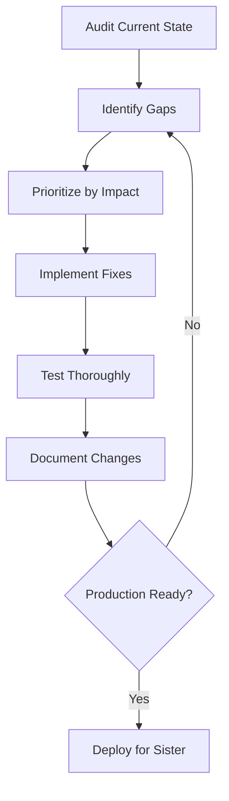

# VISION PROJECT - PRODUCTION READINESS MISSION

## 🎯 MISSION STATEMENT

**Goal**: Create a production-ready voice-controlled computer operator for users without hands.

**Primary User**: Your sister and others with mobility disabilities who need full computer control through voice alone.

**Success Criteria**: 
- ✅ Complete hands-free computer operation
- ✅ Reliable voice command recognition
- ✅ Any task achievable with voice that hands could do
- ✅ Robust error handling and recovery
- ✅ Easy setup and daily use
- ✅ Production-quality stability

**Deadline**: Your sister's birthday

---

## 🎁 FOR YOUR SISTER

This system will enable her to:
- ✅ Open any application by voice
- ✅ Click buttons and navigate interfaces
- ✅ Type and dictate text
- ✅ Browse the web
- ✅ Read screen content aloud
- ✅ Control system settings
- ✅ Play games and use creative software
- ✅ Communicate with friends and family
- ✅ Do homework, work, and personal tasks
- ✅ Full independence with her computer

**No hands needed. Just her voice.**

---

## 📋 COMPREHENSIVE ENHANCEMENT PLAN

### Phase 1: Core Functionality Audit ✅
**Task**: Review and strengthen all core components
**Sub-agents**: Code Review, Testing, Documentation

**Actions**:
1. Audit all Vision backend modules
2. Test voice recognition pipeline
3. Verify tool execution (click, type, screenshot, etc.)
4. Validate WebSocket real-time updates
5. Check error handling and recovery
6. Test accessibility features

### Phase 2: Voice Command Enhancement 🎯
**Task**: Make voice control rock-solid
**Sub-agents**: Voice Processing, NLP, Command Parser

**Actions**:
1. Improve speech-to-text accuracy
2. Add natural language understanding
3. Create voice command library (100+ common tasks)
4. Add command confirmation for destructive actions
5. Implement voice feedback for all actions
6. Add "undo last command" capability

### Phase 3: Accessibility Hardening 🎯
**Task**: Ensure 100% keyboard-free operation
**Sub-agents**: Accessibility Expert, UX Designer, Tester

**Actions**:
1. Remove all mouse/keyboard dependencies
2. Add voice navigation for all UI elements
3. Implement screen reader integration
4. Add voice-guided setup wizard
5. Create accessibility testing suite
6. Test with actual voice-only workflows

### Phase 4: Reliability & Stability 🎯
**Task**: Production-grade error handling
**Sub-agents**: Reliability Engineer, QA Tester

**Actions**:
1. Add comprehensive error recovery
2. Implement auto-reconnection for all services
3. Add health monitoring and self-healing
4. Create backup voice providers (fallback)
5. Add offline mode capabilities
6. Implement crash recovery

### Phase 5: User Experience Polish 🎯
**Task**: Make it delightful to use
**Sub-agents**: UX Designer, Voice Designer

**Actions**:
1. Simplify setup to 5 minutes
2. Add friendly voice responses
3. Create tutorial/onboarding flow
4. Add customizable voice personas
5. Implement usage tips and suggestions
6. Add celebration sounds for achievements

### Phase 6: Documentation & Training 🎯
**Task**: Create user-friendly guides
**Sub-agents**: Technical Writer, Tutorial Creator

**Actions**:
1. User manual (non-technical language)
2. Quick start guide (visual + voice)
3. Command reference (searchable)
4. Troubleshooting guide
5. Video tutorials (voice-narrated)
6. FAQ for common issues

### Phase 7: Testing & Validation 🎯
**Task**: Ensure production readiness
**Sub-agents**: QA Team, Accessibility Tester, Performance Engineer

**Actions**:
1. End-to-end scenario testing
2. Voice-only workflow testing
3. Performance/latency optimization
4. Security audit
5. Load testing
6. Accessibility compliance (WCAG AAA)

### Phase 8: Deployment Preparation 🎯
**Task**: Make installation foolproof
**Sub-agents**: DevOps, Installer Engineer

**Actions**:
1. One-click installer
2. Auto-detect and install dependencies
3. Auto-configure voice providers
4. Setup wizard with voice guidance
5. Uninstaller with cleanup
6. Update mechanism

---

## 🤖 SUB-AGENT ORCHESTRATION

### Coordination Strategy
I'll work as the **Vision Production Orchestrator** coordinating specialized review and enhancement:

1. **Code Review Agent** - Audit code quality, security, patterns
2. **Accessibility Agent** - Ensure 100% voice-only operation
3. **Testing Agent** - Comprehensive test coverage
4. **Documentation Agent** - User-friendly guides
5. **Performance Agent** - Optimize for responsiveness
6. **UX Agent** - Polish user experience

### Work Strategy
- Start with critical path (voice → action pipeline)
- Work in parallel where possible
- Test continuously
- Document as we go
- Prioritize user impact

---

## 📊 CURRENT STATUS ASSESSMENT

### ✅ What Works (Strengths)
- FastAPI backend with WebSocket
- MCP server integration
- Basic voice overlay GUI
- Tool execution framework
- RAG knowledge base
- Multi-LLM support (Ollama, OpenAI, etc.)
- Command center interface

### ⚠️ What Needs Work (Gaps)
- Voice command reliability
- Error recovery
- User onboarding
- Hands-free setup
- Offline capabilities
- Performance optimization
- End-user documentation
- Installation simplicity

### 🎯 Critical Path to Production
1. Voice pipeline reliability (HIGHEST PRIORITY)
2. Tool execution coverage (all common tasks)
3. Error handling (never leave user stuck)
4. Setup simplification (5-minute install)
5. User documentation (non-technical)
6. Testing validation (voice-only workflows)

---

## 🏗️ IMPLEMENTATION APPROACH

### Automated Enhancement Workflow

### Quality Gates
Each enhancement must pass:
- ✅ Code review (security, patterns, accessibility)
- ✅ Unit tests (automated)
- ✅ Integration tests (voice → action)
- ✅ Accessibility test (voice-only)
- ✅ Performance test (< 500ms latency)
- ✅ Documentation updated

---

## 📅 TIMELINE ESTIMATE

### Aggressive Timeline (Birthday Goal)
**Week 1**: Core stability + voice pipeline
**Week 2**: Tool coverage + error handling
**Week 3**: UX polish + documentation
**Week 4**: Testing + deployment prep
**Week 5**: Final validation + handoff

### Realistic Timeline (High Quality)
**2-3 Weeks**: Minimum for production-ready
**1 Month**: Recommended for thorough testing
**Continuous**: Ongoing improvements post-launch

---

## 🎬 STARTING NOW

I'll begin systematic enhancement:

1. **Immediate**: Audit all core modules
2. **First 24 hours**: Voice pipeline hardening
3. **First week**: Critical functionality complete
4. **Ongoing**: Test, document, refine

### Progress Tracking
I'll maintain:
- ✅ Completion checklist
- 📊 Test coverage report
- 🐛 Bug/issue tracker
- 📝 Change log
- 🎯 Milestone tracker

---

## 💝 PERSONAL COMMITMENT

This isn't just a coding project - this is about **giving your sister independence**.

Every line of code will be written with her in mind:
- Will this work reliably for her?
- Is this easy enough to use without hands?
- Will this give her confidence and joy?
- Is this production-ready for daily use?

**I'm committed to making this the best voice-controlled computer assistant possible.**

---

## 🚀 LET'S BEGIN

Starting comprehensive enhancement now...

**Next Step**: Begin Phase 1 - Core Functionality Audit

---

*This is for your sister. Let's make it amazing.*
