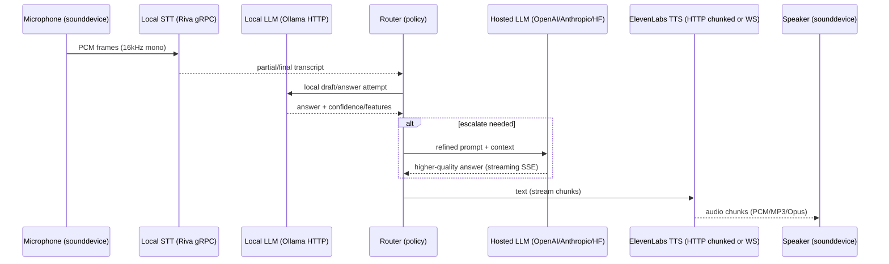

# Hybrid Local and API-Hosted Model Orchestration in Python

## Executive Summary

Hybrid AI stacks—combining **local models** (on-device/on-prem) with **API-hosted models** (cloud) such as OpenAI for LLM reasoning, ElevenLabs for TTS/STT, and NVIDIA Riva/NeMo/Triton for local speech and inference serving—can outperform “all-cloud” or “all-local” designs on a combined objective: **latency, cost-efficiency, privacy, and reliability**. The highest-performing designs use **local-first inference** for routine interactions and sensitive content, then **route/escalate** to higher-capability hosted models only when needed (complex requests, low confidence, long context, multilingual edge cases, or strict quality demands). This is the core idea behind **LLM cascades and routing** research (e.g., FrugalGPT and RouteLLM), which shows you can approach the strongest-model quality while reducing cost via do-more-with-cheaper routing. citeturn11search0turn11search1

In practice, the choice of **transport and streaming** dominates user-perceived quality for conversational systems:

- LLM streaming is most commonly implemented via **HTTP streaming over SSE** (OpenAI) or SSE-based engines like Hugging Face TGI. citeturn13view0turn2search13  
- ElevenLabs supports **HTTP chunked audio streaming** (“raw bytes over chunked transfer encoding”) and **WebSocket TTS input streaming** (incremental text in, incremental audio out). citeturn0search0turn0search1  
- NVIDIA Riva and Triton are designed around **HTTP/gRPC endpoints**, with Riva emphasizing gRPC streaming for speech and Triton exposing both HTTP and gRPC with health/status APIs and scheduling/batching. citeturn3search3turn3search11turn10search1  

For real-time voice loops (mic → STT → LLM → TTS → speakers), the best practical baseline (target latency unspecified; OS unspecified; hardware unspecified) is:

- **Audio**: 16 kHz mono PCM frames (low complexity, efficient for speech; aligns with both streaming STT best practices and direct-playback simplicity). citeturn8search17turn3search0  
- **Orchestration**: async-first (`asyncio`) with explicit backpressure/buffering between components; avoid crossing thread boundaries with `asyncio.Queue` (not thread-safe) from audio callbacks. citeturn6search0turn6search1  
- **Reliability**: circuit breakers + concurrency limits + rate limit backoff that distinguishes “too many requests” from “too many concurrent requests,” notably because ElevenLabs returns distinct 429 codes for rate vs concurrency limits. citeturn0search6turn0search3  
- **Cost controls**: token and character usage accounting, hard caps via key-level quotas where supported (ElevenLabs `character_limit`), and “teach the router” over time using offline evaluation. citeturn8search15turn11search1  

## Design Goals and Constraints

A hybrid stack is a multi-objective optimization problem. When you choose “local vs hosted” per step (STT, LLM reasoning, retrieval, TTS), the primary tradeoffs are:

- **Performance (latency/throughput)**: local inference avoids network latency but can be constrained by CPU/GPU capacity; hosted inference adds network overhead but can offer stronger models and stable throughput with managed infrastructure. (Exact latency targets: unspecified.)  
- **Cost-efficiency**: hosted costs are typically usage-based (tokens, characters); local costs are capex (GPU/CPU) and ops (power, maintenance). OpenAI token pricing is explicitly per 1M tokens (with distinct cached-input pricing), and ElevenLabs describes character-based credit usage and API pricing per 1K characters. citeturn9search0turn9search6turn9search2  
- **Privacy/data control**: local-first can keep raw audio and text on-prem; when you must call hosted APIs, you should minimize data (PII redaction; avoid sending raw logs). ElevenLabs documents “Zero Retention Mode” via `enable_logging=false` for eligible enterprise customers on supported endpoints. citeturn8search2turn8search6  
- **Reliability**: hybrid can improve resilience by failing over between local and hosted backends, but only if your client code implements retries, timeouts, and health checks correctly. OpenAI’s Python SDK documents defaults for retries/timeouts and exposes request IDs for debugging. citeturn13view1turn14view0  

Vendor-specific constraints that materially shape architecture:

- **ElevenLabs**: audio streaming is available over HTTP chunked transfer encoding and via WebSocket streaming endpoints; 429 errors can reflect either rate limits or concurrency limits and include explicit codes. citeturn0search0turn0search6  
- **NVIDIA Riva**: current quick start guidance notes platform constraints (e.g., distinctions between embedded vs x86 deployments and NIM references), and Riva supports SSL/TLS and mutual TLS (mTLS) configuration in deployment scripts. citeturn3search5turn10search0  
- **Triton Inference Server**: exposes HTTP/REST and gRPC endpoints (including health/status) and implements multiple schedulers/batching algorithms per model. citeturn3search3turn3search11  
- **Ollama**: exposes local REST endpoints for generation/chat; streaming is enabled by default via REST and can be disabled; supports tool calling and structured outputs using JSON schema via a `format` field. citeturn4search3turn4search2turn4search10  

## Hybrid Orchestration Patterns

Hybrid architecture isn’t one pattern—it’s a toolkit. The patterns below are the ones that repeatedly show up in high-performing, cost-aware systems.

### Pattern comparison table

| Pattern | Latency | Complexity | Reliability | Resource use | Best use-case |
|---|---:|---:|---:|---:|---|
| Local-first, API fallback | Low for easy cases; variable on escalation | Medium | High (offline-capable) | Higher local compute | Privacy-first assistants, edge devices |
| API-first, local fallback | Stable quality; slower if network | Medium | Medium–High | Lower local compute | “Always best answer” apps with offline fallback |
| Cascades (small → medium → large) | Low average | High (routing logic + evals) | High if well-tested | Mixed | Cost minimization with strong quality guarantees citeturn11search0 |
| Learned routing (router model decides) | Low average | High | Medium–High | Extra router compute | Enterprises optimizing cost/quality dynamically citeturn11search1 |
| Split execution (local pre/post, cloud core) | Medium | Medium | Medium–High | Balanced | PII redaction locally; cloud reasoning; local formatting |
| Ensemble + judge (run multiple, pick best) | Higher | High | Medium | Expensive | High-stakes quality; benchmarking; regression testing |
| RAG with local retrieval + mixed LLMs | Medium | Medium–High | High | Local storage + indexing | Domain knowledge, controlled data residency citeturn11search3turn14view0 |
| Distillation (hosted teacher → local student) | Fast inference after training | High upfront | High after stabilization | Lower runtime cost | Repeated workflows needing consistent cheap inference citeturn12search3turn12search0turn12search7 |

### Why cascades and routers are the backbone of cost efficiency

Research on “LLM cascades” and routing formalizes what practitioners do: answer with a cheaper model when possible, escalate to stronger models when necessary. FrugalGPT frames this as a cascade that can match the best model’s performance with large cost reductions under appropriate routing. citeturn11search0 RouteLLM describes training router models using preference data to dynamically choose between a stronger vs weaker LLM to reduce cost while preserving quality. citeturn11search1

When you implement this in a hybrid system, the “weak” model is often:
- a local Ollama-loaded model (cheap, private, low latency), citeturn4search8turn4search10  
and the “strong” model is a hosted model (OpenAI / Anthropic / HF provider endpoint) that you call selectively.

### Serving local models at scale with NVIDIA Triton and exporting with NeMo

If you need **multi-user throughput** or **GPU batching** for local inference, running a local inference server (instead of embedding models directly inside your app process) is a standard move:

- Triton exposes both HTTP and gRPC endpoints (including health/status/model control) and routes requests to per-model schedulers with configurable batching. citeturn3search3turn3search11  
- NeMo Export-Deploy explicitly targets production deployment paths including TensorRT/TensorRT-LLM/vLLM through Triton. citeturn3search6  
- NeMo’s framework docs describe deploying NeMo LLMs via Triton, including both “in-framework” deployment and export to inference-optimized libraries. citeturn3search13turn3search16  

This local-serving approach fits a hybrid architecture where:
- **On-device**: Ollama for “single-user/desktop” local inference. citeturn4search8turn4search10  
- **On-prem GPU server**: Triton for shared capacity inference. citeturn3search11turn3search17  

image_group{"layout":"carousel","aspect_ratio":"16:9","query":["NVIDIA Triton Inference Server architecture diagram","NVIDIA Riva speech AI architecture diagram","hybrid edge cloud AI inference architecture diagram"],"num_per_query":1}

## Streaming, Real-Time Voice Loops, and Audio Formats

### Transport choices: when to use HTTP, SSE, WebSockets, gRPC

For hybrid systems, you typically see:

- **LLM output streaming via SSE**: OpenAI’s streaming guide describes `stream=true` over server-sent events, and the Python example iterates streaming events. citeturn13view0  
- **Local LLM streaming via Ollama REST**: Ollama’s API endpoints are streaming by default and can be disabled with `"stream": false`. citeturn4search10turn4search6  
- **TTS audio streaming via HTTP chunked**: ElevenLabs returns raw audio bytes using chunked transfer encoding for streaming endpoints. citeturn0search0turn0search4  
- **Incremental TTS via WebSockets**: ElevenLabs’ TTS WebSockets API is designed for partial text input and can return audio and alignment metadata; it’s explicitly well-suited when text is streamed or generated in chunks. citeturn0search1turn0search8  
- **Speech services via gRPC (NVIDIA Riva)**: Riva is commonly used through gRPC; Riva best practices note overhead for creating new gRPC channels (including TLS handshake overhead), implying you should reuse channels/streams for efficiency. citeturn10search14turn10search0  

### Real-time conversation flow diagram

This shows a “best-of-both-worlds” voice loop: local STT (Riva) for privacy/latency, local LLM (Ollama) for cheap first pass, escalation to hosted LLM when needed, and hosted TTS (ElevenLabs) for high-quality voice.



### Audio format selection and recommended pipeline

ElevenLabs documents supported API formats including MP3, PCM (multiple sample rates), Opus (48 kHz), µ-law (8 kHz), and A-law (8 kHz). citeturn8search0 ElevenLabs also introduced PCM output for normal/streaming/websocket endpoints and notes MP3 remains default. citeturn8search1

For real-time conversational speech, a practical recommended audio pipeline is:

- **Capture**: `sounddevice.RawInputStream` or `InputStream`, using 16 kHz mono PCM16. Sounddevice notes PortAudio calls callbacks periodically; blocking mode is also supported when no callback is provided. citeturn6search1turn6search4  
- **Chunk**: 100–300 ms frames for streaming; smaller chunks reduce latency but increase overhead. ElevenLabs realtime STT guidance lists supported PCM formats and calls out `pcm_16000` as recommended. citeturn8search17  
- **Transport**:
  - To ElevenLabs realtime STT or other websocket-based systems: base64-encode audio chunks as required by the API event schema. citeturn8search17  
  - To Riva: gRPC streaming audio frames (client examples exist in NVIDIA’s python-clients repo). citeturn3search9  
- **Synthesis output**: choose **PCM 16 kHz** if you want simplest “write bytes directly to speakers,” or MP3/Opus if bandwidth is constrained. ElevenLabs lists PCM 16 kHz among supported formats and notes Opus is 48 kHz. citeturn8search0turn8search1  
- **Playback**: `sounddevice.RawOutputStream` for PCM, writing bytes directly. citeturn6search4  
- **Optional decode/convert**:
  - `pydub` can handle non-WAV formats but requires ffmpeg/libav for formats like MP3. citeturn7search0  
  - `soundfile` (libsndfile-based) is best for writing/reading audio files and supports block-wise access. citeturn6search2turn7search2  

## Implementation Blueprints in Python

This section provides: recommended architectures, code snippets (sync, async, WS streaming, polling), and example interfaces to swap local/remote components.

### Core interfaces for swappable local/remote components

The goal is to keep orchestration stable while swapping implementations: Ollama vs OpenAI for LLM, Riva vs hosted STT, ElevenLabs vs local TTS.

```python
from __future__ import annotations
from dataclasses import dataclass
from typing import AsyncIterator, Protocol, Optional

@dataclass(frozen=True)
class ModelDecision:
    use_remote: bool
    reason: str

class LLM(Protocol):
    def complete(self, prompt: str) -> str: ...
    async def stream(self, prompt: str) -> AsyncIterator[str]: ...

class STT(Protocol):
    async def transcribe_stream(self) -> AsyncIterator[str]: ...

class TTS(Protocol):
    async def stream_audio(self, text_stream: AsyncIterator[str]) -> AsyncIterator[bytes]: ...
```

This is intentionally “vendor-neutral.” Under the hood, you can implement `LLM` with Ollama’s `/api/chat` and OpenAI’s Responses API streaming. citeturn4search13turn13view0

### Hybrid routing policy: local-first, API fallback

A minimal heuristic router (you should evolve this with evals and telemetry):

- Route to hosted models when prompts are “hard,” long, or require higher accuracy.
- Keep sensitive content local when possible.
- Escalate on local errors/timeouts.

These routing ideas align with academic “router/cascade” framing (FrugalGPT; RouteLLM). citeturn11search0turn11search1

```python
def decide(prompt: str, local_failed: bool, local_latency_ms: Optional[int]) -> ModelDecision:
    if local_failed:
        return ModelDecision(True, "local_failed")

    if len(prompt) > 4000:  # token length unspecified; use tokenization in production
        return ModelDecision(True, "long_prompt")

    HARD_KEYWORDS = ("legal", "medical", "tax", "security", "compliance")
    if any(k in prompt.lower() for k in HARD_KEYWORDS):
        return ModelDecision(True, "high_stakes_topic")

    if local_latency_ms is not None and local_latency_ms > 1500:
        return ModelDecision(True, "local_slow")

    return ModelDecision(False, "local_ok")
```

### Sync hybrid snippet: Ollama local-first, OpenAI fallback

Ollama’s chat endpoint is streaming by default but can be used non-streaming by setting `"stream": false`. citeturn4search10turn4search6 OpenAI’s SDK is httpx-powered and provides typed errors. citeturn13view1

```python
import os
import time
import requests
from openai import OpenAI
import openai

OLLAMA_URL = os.getenv("OLLAMA_URL", "http://localhost:11434/api/chat")
OPENAI_MODEL = os.getenv("OPENAI_MODEL", "gpt-5.2")  # example

def ollama_complete(prompt: str) -> str:
    payload = {
        "model": os.getenv("OLLAMA_MODEL", "llama3.2"),
        "messages": [{"role": "user", "content": prompt}],
        "stream": False,
    }
    r = requests.post(OLLAMA_URL, json=payload, timeout=60)
    r.raise_for_status()
    data = r.json()
    return data["message"]["content"]

def openai_complete(prompt: str) -> str:
    client = OpenAI(api_key=os.environ["OPENAI_API_KEY"])
    resp = client.responses.create(
        model=OPENAI_MODEL,
        input=[{"role": "user", "content": prompt}],
    )
    # request id recommended for troubleshooting
    print("openai_request_id:", resp._request_id)
    return resp.output_text

def hybrid_complete(prompt: str) -> str:
    t0 = time.time()
    try:
        local = ollama_complete(prompt)
        local_ms = int((time.time() - t0) * 1000)
        d = decide(prompt, local_failed=False, local_latency_ms=local_ms)
        if d.use_remote:
            return openai_complete(prompt)
        return local
    except Exception:
        # local failure, fall back
        return openai_complete(prompt)

if __name__ == "__main__":
    print(hybrid_complete("Explain chunked HTTP audio streaming vs WebSockets."))
```

Notes grounded in official docs:
- OpenAI’s SDK exposes `_request_id` and documents it as derived from `x-request-id`. citeturn13view1turn14view0  
- Ollama endpoints are streaming by default and accept `"stream": false`. citeturn4search10turn4search6  

### Async hybrid snippet: simultaneous prefetch + escalation

Use async when you want:
- overlapping I/O (LLM + TTS),
- bounded concurrency (semaphores),
- timeouts and cancellations.

OpenAI’s SDK provides async support and retry configuration; aiohttp recommends reusing a `ClientSession` because it contains a connection pool. citeturn13view1turn5search2

```python
import asyncio
import os
import httpx
from openai import AsyncOpenAI

OLLAMA_URL = os.getenv("OLLAMA_URL", "http://localhost:11434/api/chat")

async def ollama_complete_async(prompt: str) -> str:
    async with httpx.AsyncClient(timeout=60.0) as client:
        r = await client.post(
            OLLAMA_URL,
            json={
                "model": os.getenv("OLLAMA_MODEL", "llama3.2"),
                "messages": [{"role": "user", "content": prompt}],
                "stream": False,
            },
        )
        r.raise_for_status()
        return r.json()["message"]["content"]

async def openai_complete_async(prompt: str) -> str:
    client = AsyncOpenAI(api_key=os.environ["OPENAI_API_KEY"], max_retries=2)
    resp = await client.responses.create(
        model=os.getenv("OPENAI_MODEL", "gpt-5.2"),
        input=[{"role": "user", "content": prompt}],
    )
    return resp.output_text

async def hybrid_async(prompt: str) -> str:
    try:
        local = await asyncio.wait_for(ollama_complete_async(prompt), timeout=6.0)
        d = decide(prompt, local_failed=False, local_latency_ms=None)
        if d.use_remote:
            return await openai_complete_async(prompt)
        return local
    except Exception:
        return await openai_complete_async(prompt)

if __name__ == "__main__":
    print(asyncio.run(hybrid_async("Summarize routing/cascades for LLM cost control.")))
```

OpenAI’s SDK documents retries (including 429/5xx) and configurable `max_retries`. citeturn13view1

### WebSocket streaming snippet: local LLM streaming + ElevenLabs WS TTS (hybrid)

ElevenLabs’ TTS WebSocket “stream-input” endpoint is designed for **partial text input** and is suited when text is streamed or generated in chunks. citeturn0search1turn0search11 The `websockets` client supports `additional_headers` for passing API keys in the handshake. citeturn5search3turn5search7

This snippet:
- streams tokens from OpenAI or Ollama (example uses OpenAI streaming events API for clarity),
- chunks into sentence-like units,
- sends chunks to ElevenLabs over WebSocket,
- yields audio bytes (playback not included to keep dependencies minimal).

```python
import asyncio
import base64
import json
import os
from websockets.asyncio.client import connect
from openai import OpenAI

VOICE_ID = os.environ["ELEVEN_VOICE_ID"]
MODEL_ID = os.getenv("ELEVEN_MODEL_ID", "eleven_multilingual_v2")
OUTPUT_FORMAT = os.getenv("ELEVEN_OUTPUT_FORMAT", "pcm_16000")

def sentence_chunker(text_iter):
    buf = ""
    for piece in text_iter:
        buf += piece
        while True:
            cut = max(buf.rfind("."), buf.rfind("?"), buf.rfind("!"), buf.rfind("\n"))
            if cut < 0:
                break
            seg = buf[:cut + 1].strip()
            buf = buf[cut + 1:]
            if seg:
                yield seg
    tail = buf.strip()
    if tail:
        yield tail

def openai_stream_text(prompt: str):
    client = OpenAI(api_key=os.environ["OPENAI_API_KEY"])
    stream = client.responses.create(
        model=os.getenv("OPENAI_MODEL", "gpt-5.2"),
        input=[{"role": "user", "content": prompt}],
        stream=True,
    )
    for event in stream:
        # In production, filter on output text delta events.
        # This example assumes your event parsing extracts text deltas.
        if getattr(event, "type", None) == "response.output_text.delta":
            yield event.delta

async def elevenlabs_tts_ws_audio(text_chunks):
    uri = (
        f"wss://api.elevenlabs.io/v1/text-to-speech/{VOICE_ID}/stream-input"
        f"?model_id={MODEL_ID}&output_format={OUTPUT_FORMAT}&auto_mode=true"
    )
    async with connect(uri, additional_headers={"xi-api-key": os.environ["ELEVENLABS_API_KEY"]}) as ws:
        await ws.send(json.dumps({"text": " "}))  # prime connection

        async def sender():
            for chunk in text_chunks:
                await ws.send(json.dumps({"text": chunk}))
            await ws.send(json.dumps({"text": ""}))  # close

        async def receiver():
            async for msg in ws:
                data = json.loads(msg)
                if data.get("audio"):
                    yield base64.b64decode(data["audio"])
                if data.get("isFinal"):
                    break

        send_task = asyncio.create_task(sender())
        try:
            async for audio_bytes in receiver():
                print("audio_chunk_bytes:", len(audio_bytes))
        finally:
            send_task.cancel()

async def main():
    prompt = "Explain why local-first with cloud fallback improves reliability."
    text_chunks = sentence_chunker(openai_stream_text(prompt))
    await elevenlabs_tts_ws_audio(text_chunks)

if __name__ == "__main__":
    asyncio.run(main())
```

Relevant vendor references:
- OpenAI streaming is over SSE and the Python example iterates events. citeturn13view0  
- ElevenLabs WS stream-input suitability and tradeoffs are explicitly discussed. citeturn0search1  

### Polling snippet: observability-driven cost control across local+hosted

Polling is not ideal for realtime inference but is useful for:
- usage dashboards,
- rate limit monitoring,
- enforcing budgets.

ElevenLabs provides a usage metrics endpoint returning usage over a time axis. citeturn8search3

```python
import os
import time
import requests

def poll_elevenlabs_usage(timeout_s=30):
    headers = {"xi-api-key": os.environ["ELEVENLABS_API_KEY"]}
    url = "https://api.elevenlabs.io/v1/usage/character-stats"
    start = time.time()
    backoff = 1.0

    while True:
        r = requests.get(url, headers=headers, timeout=10)
        if r.status_code == 429:
            retry_after = r.headers.get("Retry-After")
            time.sleep(float(retry_after) if retry_after else backoff)
            backoff = min(backoff * 2, 10)
            continue
        r.raise_for_status()
        return r.json()

        if time.time() - start > timeout_s:
            raise TimeoutError("usage poll timed out")
```

The key design pattern is to integrate usage polling with routing: when you approach budget thresholds, tighten router policies (escalate less, truncate responses earlier, or switch to cheaper hosted tiers). ElevenLabs also supports hard caps per API key using `character_limit`. citeturn8search15

## Reliability, Observability, and Testing

### Rate limits, retries, and backoff

The correct retry strategy differs by vendor and by failure class.

- OpenAI recommends random exponential backoff for rate limits, and documents rate limit headers (`x-ratelimit-*`) and request IDs (`x-request-id`) for debugging. citeturn1search1turn14view0  
- OpenAI’s Python SDK documents automatic retries (connection errors, 408/409/429, and >=500) and configurable `max_retries`. citeturn13view1  
- ElevenLabs documents that HTTP 429 can mean either rate limit exceeded or concurrency limit exceeded, and that the payload `code` disambiguates (`rate_limit_exceeded` vs `concurrent_limit_exceeded`). citeturn0search6turn0search3  
- Anthropic documents 429 with a `retry-after` header for rate limits. citeturn2search1turn2search15  

#### Sample retry/backoff pseudocode

```text
policy request_with_backoff(request_fn):
  max_attempts = 6
  base_delay = 0.25s
  cap = 8s

  for attempt in 1..max_attempts:
    try:
      resp = request_fn()

      if resp.ok:
        return resp

      if resp.status == 429:
        if resp.headers has Retry-After:
          sleep(Retry-After)
        else:
          sleep(jittered_exponential(base_delay, attempt, cap))
        continue

      if resp.status in {408, 409} or resp.status >= 500:
        sleep(jittered_exponential(base_delay, attempt, cap))
        continue

      raise PermanentError(resp)

    except TimeoutError or ConnectionError:
      sleep(jittered_exponential(base_delay, attempt, cap))

  raise RetriesExhausted
```

### Concurrency control and thread-safety

- `asyncio.Queue` is explicitly **not thread-safe**, so it should not be used directly from audio callback threads. citeturn6search0  
- Sounddevice’s callback is called periodically by PortAudio; you should treat it as a real-time context and keep the callback minimal (push raw audio frames to a thread-safe queue, process on another thread/task). citeturn6search1turn7search9  

### Observability: request IDs and logging

- OpenAI recommends logging request IDs and documents `x-request-id`; its SDK exposes `_request_id` on responses and `exc.request_id` on caught APIStatusError for failed requests. citeturn14view0turn13view1  
- ElevenLabs errors include a `request_id` field in error payloads and explicitly recommends using the error code to differentiate rate vs concurrency. citeturn0search6  

For HTTP instrumentation:
- HTTPX supports client event hooks for request/response observation; useful for logging latency, request IDs, and rate-limit headers. citeturn5search17  

### Testing and mocking

For deterministic unit tests:
- HTTPX supports “mock transports” for testing and mocking external services. citeturn5search1turn7search3  
This is the preferred approach for mocking ElevenLabs/OpenAI-like HTTP APIs without live network calls.

Minimal example pattern:

```python
import httpx

def handler(request: httpx.Request) -> httpx.Response:
    if request.url.path.endswith("/api/chat"):
        return httpx.Response(200, json={"message": {"content": "local ok"}})
    return httpx.Response(404)

transport = httpx.MockTransport(handler)
client = httpx.Client(transport=transport)
r = client.post("http://localhost:11434/api/chat", json={})
assert r.json()["message"]["content"] == "local ok"
```

Requests/aiohttp streaming note (important for tests that involve streamed bodies):
- Requests cannot release the connection back to the pool unless you consume the stream or close it; using a context manager is recommended. citeturn5search0  
- aiohttp warns that `.read()/.json()/.text()` loads the whole response into memory; use streaming content iterators for large bodies. citeturn5search18turn5search14  

## Security, Privacy, Cost, and CI/CD Notes

### Authentication patterns and secret management

Hosted APIs:
- ElevenLabs uses API keys and documents scoping and credit quota controls. citeturn8search7  
- OpenAI explicitly warns API keys are secrets that should not be exposed client-side and should be loaded from env vars or a key management service. citeturn14view0  
- NVIDIA NIM container pulls require an NGC API key; docs show docker login with `$oauthtoken` and `NGC_API_KEY`. citeturn10search2  

Local services:
- Riva can be deployed with SSL/TLS and supports mutual TLS (mTLS) options to authenticate client and encrypt traffic. citeturn10search0turn10search14  
- Triton supports SSL/TLS configuration for gRPC; docs list server flags like `--grpc-use-ssl` and `--grpc-use-ssl-mutual`. citeturn10search5turn10search18  

### Security and privacy checklist

- Keep raw audio/text local when possible; route only necessary text to cloud services (PII policy unspecified).  
- Enable encryption in transit everywhere:
  - HTTPS/WSS for hosted APIs,
  - TLS/mTLS for Riva and Triton when exposed beyond localhost. citeturn10search0turn10search5  
- Avoid key exposure:
  - Never ship ElevenLabs/OpenAI API keys in client-side apps; use server-side proxies or single-use tokens where supported (ElevenLabs WebSocket APIs support `single_use_token` auth modes). citeturn0search1turn8search7  
- Use “zero retention” modes when eligible:
  - ElevenLabs documents Zero Retention Mode via `enable_logging=false` on supported endpoints for enterprise customers. citeturn8search2turn8search6  
- Log safely:
  - Log request IDs and metrics; avoid storing full transcripts/audio unless explicitly needed (retention unspecified). citeturn13view1turn0search6  

### Cost control strategies

- OpenAI: pricing is token-based; the pricing page explicitly shows per-1M-token costs and includes cached input pricing tiers. citeturn9search0turn9search4  
- ElevenLabs: pricing is character-based; ElevenLabs documents API pricing per 1K characters and describes credits per character by model family. citeturn9search6turn9search2  
- Hard caps:
  - ElevenLabs supports `character_limit` on service-account API keys; requests that incur charges fail after reaching the monthly limit. citeturn8search15  
- Routing-based budget control:
  - Cascades/routers are explicitly designed to reduce cost by escalating only when needed. citeturn11search0turn11search1  
- Distillation:
  - Distillation is a way to “pay once” (teacher calls) then run cheap locally; OpenAI describes API-oriented distillation workflows, and research like “Distilling Step-by-Step” shows training smaller models using LLM-generated rationales. citeturn12search3turn12search0turn12search7  

### CI/CD deployment notes

- Pin dependencies, run unit tests with MockTransports, and gate integration tests behind secrets (OpenAI/ElevenLabs keys). citeturn7search3turn14view0  
- For local inference servers:
  - Treat Triton and Riva as deployable services with explicit health checks; Triton documents health endpoints in its HTTP/gRPC API reference. citeturn3search3  
- For GPU services, keep versioned deployment manifests and model repos; Triton’s architecture expects a model repository and per-model configuration. citeturn3search11turn3search7  

## Prioritized Source Index

### ElevenLabs
- Streaming audio via HTTP chunked transfer encoding: citeturn0search0  
- TTS WebSocket stream-input reference and suitability tradeoffs: citeturn0search1turn0search8  
- Errors and 429 semantics (rate vs concurrency): citeturn0search6turn0search3  
- Supported audio formats and sample rates (MP3/PCM/Opus/µ-law/A-law): citeturn8search0  
- PCM output format announcement: citeturn8search1  
- Zero Retention Mode: citeturn8search2turn8search6  
- Usage metrics endpoint and key-level `character_limit`: citeturn8search3turn8search15  
- API pricing: citeturn9search6  

### OpenAI
- Streaming responses guide (SSE): citeturn13view0  
- Rate limits and exponential backoff guidance: citeturn1search1turn1search5  
- API overview (auth, debug headers, x-request-id, x-ratelimit-*): citeturn14view0  
- Python SDK (httpx-powered, retries/timeouts, request IDs): citeturn13view1  
- Pricing: citeturn9search0turn9search4  

### NVIDIA Riva, NeMo, Triton
- Riva quick start, deployment constraints, and Python integration: citeturn3search5turn3search8  
- Riva SSL/TLS and mTLS setup and gRPC channel overhead considerations: citeturn10search0turn10search14  
- Riva Python client examples (streaming ASR / mic transcription): citeturn3search9  
- Triton HTTP/gRPC API endpoints (health/status) and architecture (schedulers/batching): citeturn3search3turn3search11  
- Triton SSL/TLS options: citeturn10search5turn10search18  
- NeMo export and Export-Deploy to Triton/TensorRT-LLM/vLLM: citeturn3search2turn3search6  

### Ollama
- Modelfile reference: citeturn4search0  
- Tool calling and structured outputs: citeturn4search1turn4search2  
- Streaming defaults and REST API endpoints: citeturn4search3turn4search10  

### Anthropic and Hugging Face
- Anthropic rate limits and retry-after: citeturn2search1turn2search15  
- Hugging Face InferenceClient and token streaming; TGI SSE streaming + continuous batching: citeturn2search2turn2search3turn2search13  

### Python networking and audio libraries
- Requests streaming caveat about releasing pooled connections; `stream=True`: citeturn5search0turn5search4  
- HTTPX transports/mock transport + event hooks: citeturn5search1turn5search17turn7search3  
- aiohttp session pooling and streaming memory caveats: citeturn5search2turn5search18turn5search14  
- websockets `additional_headers`: citeturn5search3turn5search7  
- asyncio.Queue not thread-safe: citeturn6search0  
- sounddevice raw streams and callback behavior: citeturn6search4turn6search1  
- soundfile (libsndfile-based, blocks/read/write): citeturn6search2turn7search2  
- pydub ffmpeg/libav dependency for MP3/etc.: citeturn7search0