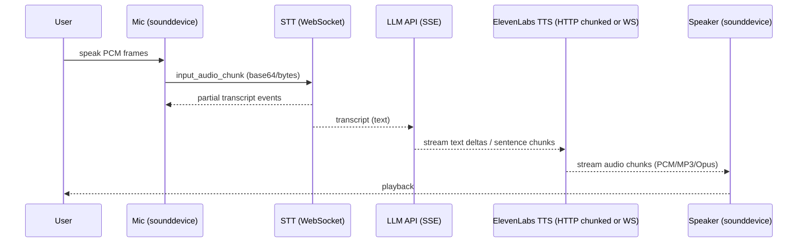

# Best Python Communication Methods for Conversational LLM Voice Systems with ElevenLabs

## Executive Summary

A “voice conversation loop” in Python—microphone input → LLM reasoning → spoken audio output—is dominated by *transport choices* (HTTP vs SSE vs WebSocket), *streaming granularity* (tokens, sentences, audio chunks), and *real-time concurrency boundaries* (audio callback threads vs network event loops). ElevenLabs supports both **HTTP audio streaming via chunked transfer encoding** and **WebSocket-based text-to-speech input streaming**, enabling incremental playback of synthesized speech. citeturn7view1turn7view2

For most Python script deployments (OS unspecified; target latency unspecified), the best default is an **async-first architecture** built around `asyncio`, using official SDKs where possible:
- **ElevenLabs Python SDK** for TTS streaming (and optional STT), because it directly exposes streaming iterators and request options like `enable_logging` and latency optimization flags. citeturn7view1turn5search31turn6search7  
- **LLM provider SDKs** (OpenAI / Anthropic / Hugging Face) for streaming text deltas via **SSE** (`stream=True`), plus provider-native request IDs, rate-limit headers, and structured errors. citeturn7view3turn1search3turn2search0turn11view0turn6search2

A pragmatic decision ladder that repeatedly works in production:

- **Start with HTTP chunked TTS streaming** (simpler, robust) and play bytes as they arrive; upgrade to **WebSocket stream-input** only when you need “speak while generating” with tighter coupling and alignment metadata. ElevenLabs explicitly notes the WebSocket TTS API uses buffering and can be slightly higher latency than standard HTTP when full text is available, and that it adds complexity. citeturn7view2turn5search3  
- Use **sentence/phrase chunking** between the LLM stream and the TTS subsystem for stable prosody and lower re-synthesis waste. This matches ElevenLabs’ own positioning: WebSocket TTS is best when text arrives in chunks, while HTTP endpoints suit when text is available upfront. citeturn7view2turn5search3  
- Treat **429** as two different problems: **rate limit** vs **concurrency limit**. ElevenLabs returns distinct error codes (`rate_limit_exceeded` vs `concurrent_limit_exceeded`) inside structured error payloads, and publishes concurrency limits by plan that may change over time. citeturn0search7turn0search37turn7view0  
- Build observability around **request IDs**: ElevenLabs includes `request_id` in error payloads; OpenAI and Anthropic SDKs expose `_request_id` mapped from response headers. citeturn7view0turn9search1turn6search2  
- For audio, prefer **PCM (S16LE) at 16 kHz mono** for low-latency interactive playback. ElevenLabs recommends 16 kHz and mono for realtime STT streaming, and provides multiple PCM output formats across normal, streaming, and WebSocket endpoints. citeturn5search26turn5search1turn5search4

Unspecified details that materially affect engineering decisions:
- Target end-to-end latency budget (unspecified).  
- OS / audio stack (unspecified).  
- Whether echo cancellation, barge-in interruption, or full duplex audio is required (unspecified).  
- Whether the system runs on a desktop client vs a server with remote audio I/O (unspecified).

## System and Transport Architectures

### Communication building blocks and where they fit

A typical vendor-neutral conversational voice system has these boundaries:

- **Mic capture → STT**: continuous PCM audio frames uploaded over WebSocket or HTTP streaming (if realtime), returning partial/final transcripts. ElevenLabs provides a realtime STT WebSocket API with explicit event flow and chunking guidance. citeturn0search30turn5search26  
- **Transcript → LLM**: request/response or streaming via **SSE** (server-sent events). OpenAI’s streaming guide explicitly frames streaming as HTTP streaming over SSE; Anthropic’s SDK supports SSE streaming; Hugging Face InferenceClient supports token streaming with `stream=True`. citeturn7view3turn1search3turn2search0  
- **LLM text → TTS**: either (a) full text to TTS, or (b) chunked text to TTS, or (c) incremental text over WebSocket input streaming.

ElevenLabs supports:
- **HTTP streaming**: returns raw audio bytes over HTTP using **chunked transfer encoding**, enabling incremental playback. citeturn5search3turn7view1  
- **TTS WebSocket stream-input**: bidirectional session for partial text → audio chunks, with optional alignment metadata and an `auto_mode` parameter intended to reduce latency by disabling buffering schedules. citeturn7view2  
- **Single-use tokens** for exposing realtime connections to untrusted clients without leaking the master API key (explicitly documented for realtime STT and supported as a query option in TTS WebSocket). citeturn0search30turn7view2turn5search2

### Streaming modalities compared

**SSE** (server → client) is typically used for *LLM output streaming* and is carried over HTTP as `text/event-stream`. citeturn7view3turn8search0  
**WebSockets** provide full duplex communication (client ↔ server) and are generally preferred for realtime audio in/out or incremental input streaming. citeturn8search1turn7view2  
**Chunked HTTP audio streaming** is a practical middle ground for TTS: it’s “just HTTP,” but you can still play audio incrementally. citeturn5search3turn7view1

image_group{"layout":"carousel","aspect_ratio":"16:9","query":["Server-Sent Events text event-stream diagram","WebSocket full duplex communication diagram","HTTP chunked transfer encoding streaming diagram"],"num_per_query":1}

### Comparison table of approaches

The following table focuses on *communication method choice* for Python scripts. Capabilities cited are from provider docs; the “latency/complexity” columns are engineering judgments based on those documented capabilities and typical behavior.

| Approach | Latency | Complexity | Reliability | Resource use | Best use-case |
|---|---:|---:|---:|---:|---|
| LLM non-streaming + ElevenLabs non-streaming TTS | Higher (wait for full text + full audio) | Low | High | Higher memory (buffering full audio) | Simple CLI bots, batch narration |
| LLM non-streaming + ElevenLabs **HTTP chunked** TTS | Medium (play as audio arrives) | Low–Medium | High | Low memory (stream) | Quick “speak responses” without WS citeturn5search3 |
| LLM **SSE streaming** + sentence chunking + ElevenLabs HTTP chunked TTS per chunk | Lower perceived latency (first sentence speaks early) | Medium | Medium–High | More requests; moderate CPU | “Speak while thinking” UX without WS citeturn7view3turn5search3 |
| LLM SSE streaming + ElevenLabs **TTS WebSocket stream-input** | Potentially lowest start latency | High | Medium (reconnect/buffer logic) | Efficient; steady CPU | True realtime conversational speech that tracks generation citeturn7view2 |
| Polling long-running jobs (or webhook async) | Not realtime | Medium | High | Low | Long files, offline workflows (not conversation loops) citeturn5search18 |

### Authentication patterns and secret management

#### ElevenLabs

- Every ElevenLabs API request must include the API key via the `xi-api-key` header, and the docs explicitly warn not to expose keys in client-side code. citeturn0search0turn5search2  
- API keys can be scoped and can have credit/usage limit controls; the authentication page describes scope restriction and quota/credit limits. citeturn5search2  
- For WebSocket/Realtime endpoints and client-side scenarios, ElevenLabs supports **single-use tokens** to avoid exposing the primary API key. citeturn0search30turn7view2turn5search2  

#### OpenAI

- OpenAI requires Bearer authentication, and explicitly states keys should be loaded from environment variables or a key management service and not exposed client-side. citeturn1search8turn1search4  
- OpenAI also documents adding your own client request tracing ID via `X-Client-Request-Id`, plus the use of `x-request-id` and rate-limit headers for debugging. citeturn11view0

#### Anthropic

- Anthropic’s Python SDK supports sync/async, and documents request IDs (`_request_id`) derived from the `request-id` response header. citeturn1search3turn6search2

#### Hugging Face

- Hugging Face recommends **User Access Tokens** to authenticate, and documents multiple ways to supply tokens, including environment variables. citeturn2search1turn2search9

## Real-Time Conversation Loop and Audio Pipeline

### Reference flow as a sequence diagram

This is the vendor-neutral “golden path”: mic capture → STT realtime WebSocket → LLM SSE streaming → TTS streaming → speaker. ElevenLabs documents realtime STT over WebSocket with audio chunk event flow; OpenAI documents SSE streaming; ElevenLabs documents TTS streaming via HTTP chunked transfer or WebSocket stream-input. citeturn0search30turn7view3turn5search3turn7view2



### Recommended audio pipeline and parameters

A low-latency pipeline that minimizes CPU and avoids “format thrash”:

1. **Capture** (mic): `sounddevice.RawInputStream` (PCM frames as Python buffer objects; NumPy optional). citeturn4search1turn4search17  
2. **Normalize**: keep audio **mono**, PCM16, at **16 kHz** (recommended in ElevenLabs realtime STT guidance for quality/bandwidth balance; mono only supported there per guidance). citeturn5search26  
3. **Chunk**: 100–500 ms chunks are typical; ElevenLabs suggests 0.1–1.0 seconds for smooth streaming, with smaller chunks for lower latency and higher overhead. citeturn5search26  
4. **Encode for transport**:
   - For ElevenLabs realtime STT WebSocket and agents WebSocket patterns, audio is typically sent as base64 in JSON event payloads (per API examples). citeturn0search30turn0search24  
5. **Synthesize** (TTS output):
   - Prefer **PCM (S16LE)** (`pcm_16000`, etc.) for realtime playback, because you can write bytes directly to output, avoiding MP3 decode costs and additional buffering. ElevenLabs introduced PCM output format for normal, streaming, and WebSocket endpoints with multiple sample rates and states mp3 remains default. citeturn5search1turn5search4  
6. **Play**: `sounddevice.RawOutputStream` for PCM frames (blocking write loop or callback). citeturn4search1turn4search5  
7. **File capture/debug (optional)**:
   - Use `soundfile` to write regression fixtures or logs (libsndfile-based). citeturn4search2  
   - Use `wave` for simple PCM-only WAV writing (standard library limitation: uncompressed PCM WAV). citeturn4search3  
   - Use `pydub` when you need format conversion (MP3 ⇄ WAV etc.), but note MP3 requires ffmpeg/libav. citeturn4search0

### Audio format selection for conversational systems

ElevenLabs documents these key output formats and typical uses:

- **MP3**: broadly compatible; variable sample rates and bitrates based on `output_format` options; default is mp3. citeturn5search4turn5search3  
- **PCM (S16LE)**: multiple sample rates; best for low-latency streaming and direct speaker output; newly emphasized by ElevenLabs across endpoints. citeturn5search1turn5search4turn7view1  
- **µ-law / A-law (8 kHz)**: telephony-oriented formats; explicitly called out by ElevenLabs as optimized for telephony. citeturn5search4turn0search9  
- **Opus (48 kHz)**: highly efficient streaming codec (good network efficiency), but requires decode support and more careful pipeline integration. citeturn5search4  
- **WAV**: useful for tooling and interoperability; for standard-library handling you’re limited to uncompressed PCM WAV via `wave`. citeturn4search3turn5search0

### Example modules and interfaces for a conversational loop

The key Python engineering constraint is that **audio I/O callbacks may run in non-async threads**, while `asyncio` primitives (like `asyncio.Queue`) are explicitly **not thread-safe**. citeturn3search15turn4search1

A clean pattern is:

- Audio callbacks push raw PCM frames into a **thread-safe** `queue.Queue`.
- The async event loop drains that queue and performs network I/O (STT/LLM/TTS).
- TTS audio bytes are streamed to a playback coroutine which writes into `RawOutputStream`.

```python
# conversational_loop.py
from __future__ import annotations

import asyncio
import queue
import time
from dataclasses import dataclass
from typing import AsyncIterator, Protocol, Optional

@dataclass(frozen=True)
class AudioConfig:
    sample_rate: int = 16000
    channels: int = 1
    dtype: str = "int16"
    chunk_ms: int = 200  # aligns with 0.1–1.0s guidance; tune as needed

class LLMStreamer(Protocol):
    async def stream_text(self, prompt: str) -> AsyncIterator[str]:
        """Yield text deltas/tokens from an LLM provider."""
        ...

class TTSStreamer(Protocol):
    async def stream_audio(self, text_chunks: AsyncIterator[str]) -> AsyncIterator[bytes]:
        """Yield audio bytes from text chunks."""
        ...

def sentence_chunker() -> callable:
    async def _chunk(stream: AsyncIterator[str]) -> AsyncIterator[str]:
        buf = ""
        async for delta in stream:
            buf += delta
            # naive boundaries; replace with your preferred segmentation
            while True:
                idx = max(buf.rfind("."), buf.rfind("?"), buf.rfind("!"), buf.rfind("\n"))
                if idx < 0:
                    break
                out = buf[: idx + 1].strip()
                buf = buf[idx + 1 :]
                if out:
                    yield out
        tail = buf.strip()
        if tail:
            yield tail
    return _chunk

class ConversationLoop:
    def __init__(self, llm: LLMStreamer, tts: TTSStreamer):
        self.llm = llm
        self.tts = tts

    async def run_once(self, user_text: str) -> AsyncIterator[bytes]:
        # text -> token stream
        token_stream = self.llm.stream_text(user_text)
        # tokens -> sentence chunks
        chunk_stream = sentence_chunker()(token_stream)
        # chunks -> audio bytes
        async for audio in self.tts.stream_audio(chunk_stream):
            yield audio
```

Why this structure is operationally sound:
- It keeps **provider-specific streaming** behind `LLMStreamer` and `TTSStreamer`, preventing transport decisions (SSE vs WebSocket vs HTTP chunked) from leaking everywhere. citeturn7view3turn7view2turn5search3  
- It allows disciplined backpressure: your `stream_audio()` implementation can wait if playback buffers are full, rather than sending unlimited requests. citeturn8search17turn3search15

## Recommended Architectures and Direct-Use Python Snippets

This section provides the requested sync, async, streaming WebSocket, and polling patterns. All snippets are “script-ready,” but include placeholders (voice IDs, models) and assume OS/audio devices are unspecified.

### Sync pattern

Use this for: simplest scripts, minimal concurrency, “generate → speak.” ElevenLabs’ docs show using the Python SDK to stream audio and optionally play it via the SDK helper. citeturn7view1

```python
import os
from elevenlabs import stream
from elevenlabs.client import ElevenLabs

VOICE_ID = os.getenv("ELEVEN_VOICE_ID", "YOUR_VOICE_ID")
MODEL_ID = os.getenv("ELEVEN_MODEL_ID", "eleven_multilingual_v2")

def llm_call(prompt: str) -> str:
    # Provider-agnostic placeholder.
    return f"You said: {prompt}"

def main():
    client = ElevenLabs(api_key=os.environ["ELEVENLABS_API_KEY"])
    user = input("You: ").strip()
    text = llm_call(user)

    audio_stream = client.text_to_speech.stream(
        text=text,
        voice_id=VOICE_ID,
        model_id=MODEL_ID,
    )

    # Plays streamed audio locally (SDK utility)
    stream(audio_stream)

if __name__ == "__main__":
    main()
```

This relies on ElevenLabs’ documented chunked audio streaming behavior and the SDK’s helper utilities. citeturn7view1turn5search3

### Async pattern

Use this for: interactive systems, multiple in-flight requests, structured timeouts, and streaming.

This example focuses on architecture rather than a specific LLM provider. The reason to prefer async is that the underlying clients (`httpx`, `aiohttp`, provider SDKs) are optimized for concurrent I/O, and both OpenAI and Anthropic explicitly support async clients in their SDKs. citeturn2search38turn1search3turn6search28

```python
import asyncio
import os
from elevenlabs.client import AsyncElevenLabs

VOICE_ID = os.getenv("ELEVEN_VOICE_ID", "YOUR_VOICE_ID")
MODEL_ID = os.getenv("ELEVEN_MODEL_ID", "eleven_multilingual_v2")

async def llm_complete(prompt: str) -> str:
    # Replace with OpenAI/Anthropic/HF async client call.
    await asyncio.sleep(0.05)
    return f"Async reply: {prompt}"

async def synthesize_bytes(text: str) -> bytes:
    client = AsyncElevenLabs(api_key=os.environ["ELEVENLABS_API_KEY"])
    audio = await client.text_to_speech.convert(
        voice_id=VOICE_ID,
        model_id=MODEL_ID,
        text=text,
        output_format="mp3_44100_128",
    )
    if isinstance(audio, (bytes, bytearray)):
        return bytes(audio)
    return b"".join(audio)

async def main():
    prompt = input("You: ").strip()
    text = await asyncio.wait_for(llm_complete(prompt), timeout=30)
    audio = await asyncio.wait_for(synthesize_bytes(text), timeout=60)
    print("Audio bytes:", len(audio))

if __name__ == "__main__":
    asyncio.run(main())
```

Provider capabilities referenced:
- OpenAI streaming/async patterns and SSE streaming exist in official docs. citeturn7view3turn2search38  
- Anthropic Python SDK explicitly supports sync/async and streaming. citeturn1search3  
- ElevenLabs streaming and output formats are documented. citeturn5search3turn5search4

### Streaming WebSocket pattern for ElevenLabs TTS stream-input

Use this for: incremental text input and immediate audio output, while the LLM is still generating. ElevenLabs documents the endpoint, message flow, `auto_mode`, and single-use token authentication option. citeturn7view2turn5search2  
Use the `websockets` library’s `additional_headers` to pass `xi-api-key`. citeturn3search2turn3search10

```python
import asyncio
import base64
import json
import os
from websockets.asyncio.client import connect

VOICE_ID = os.getenv("ELEVEN_VOICE_ID", "YOUR_VOICE_ID")
MODEL_ID = os.getenv("ELEVEN_MODEL_ID", "eleven_multilingual_v2")
OUTPUT_FORMAT = os.getenv("ELEVEN_OUTPUT_FORMAT", "pcm_16000")

def chunk_text(text: str):
    buf = ""
    for ch in text:
        buf += ch
        if ch in ".?!\n":
            yield buf
            buf = ""
    if buf.strip():
        yield buf

async def tts_ws_stream(text: str):
    api_key = os.environ["ELEVENLABS_API_KEY"]
    uri = (
        f"wss://api.elevenlabs.io/v1/text-to-speech/{VOICE_ID}/stream-input"
        f"?model_id={MODEL_ID}&output_format={OUTPUT_FORMAT}&auto_mode=true"
    )

    async with connect(uri, additional_headers={"xi-api-key": api_key}) as ws:
        # initialize
        await ws.send(json.dumps({"text": " "}))

        async def sender():
            for part in chunk_text(text):
                await ws.send(json.dumps({"text": part}))
            await ws.send(json.dumps({"text": ""}))  # close

        async def receiver():
            async for msg in ws:
                data = json.loads(msg)
                if "audio" in data and data["audio"]:
                    yield base64.b64decode(data["audio"])
                if data.get("isFinal"):
                    break

        send_task = asyncio.create_task(sender())
        try:
            async for audio_chunk in receiver():
                # replace with playback or file write
                print("got audio chunk bytes:", len(audio_chunk))
        finally:
            send_task.cancel()

async def main():
    await tts_ws_stream("Hello. This is WebSocket streaming text to speech.")

if __name__ == "__main__":
    asyncio.run(main())
```

Important ElevenLabs constraints:
- WebSocket TTS is recommended when text is streamed/chunked or you need alignment; it may involve buffering and can be higher latency than a standard HTTP request if the full text is already known. citeturn7view2  
- `auto_mode` is documented as reducing latency by disabling chunk scheduling/buffers (recommended for full sentences/phrases). citeturn7view2  
- You can authenticate via `single_use_token` instead of `xi-api-key` for client-initiated sessions. citeturn7view2turn5search2  

### Polling pattern

Use this for: workflows that are not streaming-native, job-based endpoints, or for periodically pulling usage/cost metrics. ElevenLabs provides a usage metrics endpoint with time axis and breakdowns. citeturn5search17

```python
import os
import time
import requests

def poll_json(url: str, headers: dict, timeout_s: int = 120) -> dict:
    start = time.time()
    delay = 0.5
    while True:
        if time.time() - start > timeout_s:
            raise TimeoutError("Polling timed out")

        r = requests.get(url, headers=headers, timeout=30)

        if r.status_code == 429:
            retry_after = r.headers.get("Retry-After")
            sleep_s = float(retry_after) if retry_after else delay
            time.sleep(sleep_s)
            delay = min(delay * 2, 8.0)
            continue

        r.raise_for_status()
        data = r.json()

        # replace with real completion condition for your endpoint
        if data.get("status") in ("done", "completed", "succeeded"):
            return data

        time.sleep(delay)
        delay = min(delay * 1.5, 5.0)

def main():
    headers = {"xi-api-key": os.environ["ELEVENLABS_API_KEY"]}
    # Example: usage endpoint (replace with your own URL params)
    url = "https://api.elevenlabs.io/v1/usage/character-stats"
    print(poll_json(url, headers=headers, timeout_s=30))

if __name__ == "__main__":
    main()
```

This aligns with:
- Requests’ recommendation to use iterator/streaming APIs for large bodies where appropriate. citeturn3search0  
- ElevenLabs usage endpoint existence and structure. citeturn5search17  

## Reliability, Concurrency, and Observability

### Rate limits and retries

#### What 429 means in practice

ElevenLabs explicitly distinguishes:
- `rate_limit_exceeded` (too many requests) vs
- `concurrent_limit_exceeded` (too many in-flight requests). citeturn0search7turn7view0  

ElevenLabs also publishes plan-based concurrency limits for TTS that can change over time; treat these as operational settings, not constants. citeturn0search37turn0search3  

OpenAI recommends random exponential backoff to avoid hammering the API when rate limited. citeturn1search2turn1search6

### Sample retry/backoff policy pseudocode

This policy is intentionally *transport-aware*: it distinguishes retryable failures (timeouts, transient 5xx, explicit 429) from non-retryable errors (most 4xx validation errors). ElevenLabs errors are structured and include `code` and `request_id`, which makes classification more reliable. citeturn7view0turn6search3

```text
function call_with_retries(make_request):
    max_attempts = 6
    base = 0.25 seconds
    cap  = 8.0 seconds

    for attempt in 1..max_attempts:
        try:
            resp = make_request()

            if resp.ok:
                return resp

            # 429: rate vs concurrency
            if resp.status == 429:
                if resp.json.detail.code == "concurrent_limit_exceeded":
                    # Don't just retry instantly; reduce concurrency or queue.
                    sleep(jittered_exponential(base, attempt, cap))
                    continue
                if resp.json.detail.code == "rate_limit_exceeded":
                    if "Retry-After" in resp.headers:
                        sleep(resp.headers["Retry-After"])
                    else:
                        sleep(jittered_exponential(base, attempt, cap))
                    continue

            if resp.status in {408, 409} or resp.status >= 500:
                sleep(jittered_exponential(base, attempt, cap))
                continue

            raise PermanentError(resp)

        except NetworkTimeout:
            sleep(jittered_exponential(base, attempt, cap))
        except ConnectionError:
            sleep(jittered_exponential(base, attempt, cap))

    raise RetriesExhausted
```

### Concurrency and thread-safety

Key operational hazards:

- `asyncio.Queue` is explicitly **not thread-safe**, so audio callback threads must not push directly into it. citeturn3search15  
- Audio libraries like `sounddevice` can operate in callback mode where the PortAudio callback thread is not the same as the `asyncio` event loop thread; treat the boundary conservatively (thread-safe queue or `loop.call_soon_threadsafe`). citeturn4search1turn4search17  
- `requests.Session` provides connection pooling and keep-alive, but connections are released back to the pool only after response bodies are read; failing to drain streams can silently reduce throughput and increase latency. citeturn3search1turn3search28  
- `aiohttp.ClientSession` contains a connection pool and is recommended to be long-lived; creating a session per request is explicitly discouraged, and keep-alive is on by default. citeturn8search10turn8search6turn8search2  
- `httpx` provides sync and async APIs, streaming response interfaces, and explicit timeout types (connect/read/write/pool), which are essential knobs for robust streaming systems. citeturn6search28turn2search2turn8search3  

### Error handling and observability

#### Request IDs and correlation

- ElevenLabs error responses include a `request_id` field inside the `detail` payload. citeturn7view0  
- OpenAI recommends logging request IDs and returns `x-request-id` in headers; the OpenAI Python SDK exposes `_request_id`, and OpenAI documents adding `X-Client-Request-Id` for client-generated correlation IDs. citeturn11view0turn9search1  
- Anthropic’s Python SDK exposes `_request_id` derived from the `request-id` header. citeturn6search2  

#### Streaming-specific error edge cases

Anthropic explicitly warns that with SSE streaming an error may occur *after* returning HTTP 200, which can break naive “status-code-only” error handling. Treat the stream as a long-lived state machine and parse error events, not just initial status. citeturn1search11turn1search3

#### Instrumentation hooks

- `httpx` supports event hooks to observe request/response events and can be configured with built-in logging (`httpx` and `httpcore` loggers). citeturn6search1turn6search13  
- For deterministic unit tests, `httpx.MockTransport` is a first-class testing mechanism to return predefined responses without real network calls. citeturn6search0turn6search12  

## Security, Privacy, and Cost Control

### Security and privacy checklist

- **Do not embed keys in client-side apps**: ElevenLabs explicitly warns API keys are secrets and must not be exposed in client-side code. citeturn0search0turn5search2  
- **Prefer single-use tokens** for client-side realtime sessions (ElevenLabs documents token-based auth options for realtime STT and TTS WebSockets). citeturn0search30turn7view2turn5search2  
- **Secrets via env vars / secret managers**:
  - OpenAI explicitly recommends environment variables or secret management services and not hard-coding keys. citeturn1search8turn1search4  
  - Hugging Face documents providing tokens via environment variables. citeturn2search9turn2search1  
- **Encrypt in transit (TLS)**: Do not disable certificate verification in production; Requests’ docs highlight TLS verification controls and the security implications of altering them. citeturn3search1  
- **Zero retention / logging controls**:
  - ElevenLabs SDK docs describe `enable_logging=false` as enabling “zero retention mode” for eligible Enterprise customers, with history features unavailable. citeturn5search31  
- **Local caching** (if used) must be audited:
  - If you persist transcripts or audio, treat them as potentially containing PII; encrypt at rest and define retention windows (policy requirements unspecified).  
- **Redaction strategy** (recommended):
  - Redact sensitive entities before sending to third-party APIs where feasible (PII definition and threat model unspecified).

### Cost control mechanisms

#### ElevenLabs

- Enforce a **hard usage cap per API key**: ElevenLabs service-account API key creation supports a `character_limit`, and requests that incur charges will fail after reaching that monthly limit. citeturn0search4  
- Monitor usage via the **usage metrics endpoint**, which returns a time axis and breakdowns. citeturn5search17  
- Choose `output_format` by tradeoff:
  - PCM increases bandwidth; MP3/Opus reduce bandwidth but can increase decode CPU and buffering. ElevenLabs documents available output formats and sample rates. citeturn5search4turn5search1  

#### LLM providers

- Use provider rate-limit headers and token usage information where available:
  - OpenAI documents rate-limit headers (`x-ratelimit-*`) and recommends logging request IDs and debugging fields. citeturn11view0  
  - Hugging Face token streaming reduces perceived latency and can allow early cutoff if you implement “stop speaking once enough content is produced.” citeturn2search0turn2search4  

## Testing and CI/CD Deployment Notes

### Testing strategy

A robust test pyramid for a voice conversation system:

- **Unit tests** (fast):
  - Sentence chunker correctness (punctuation rules, maximum segment size).
  - Retry policy classifier tests: given status codes and error payloads, choose retry vs fail vs reduce concurrency.
  - Buffer mechanics: ring buffer correctness, “no underrun” invariants (audio device behavior unspecified).

- **Transport unit tests with httpx.MockTransport**:
  - Mock ElevenLabs endpoints for convert/stream: return a sequence of byte chunks and verify your playback/buffer layer consumes incrementally.
  - Mock 429 responses with `.json()` including `detail.code` and ensure your policy differentiates concurrency vs rate limit. ElevenLabs error schema documents `detail` and `request_id`. citeturn7view0turn6search0  

- **Integration tests** (network; gated by secrets):
  - One “smoke” test per provider: OpenAI streaming SSE, Anthropic streaming SSE, Hugging Face stream=True, and ElevenLabs streaming TTS.
  - Verify that request IDs are logged:
    - OpenAI `_request_id` and `X-Client-Request-Id`. citeturn11view0turn9search1  
    - Anthropic `_request_id`. citeturn6search2  
    - ElevenLabs `detail.request_id` on forced error input. citeturn7view0  

### CI/CD notes

- **Secret injection**:
  - Store API keys in CI secret stores and inject as environment variables at runtime; avoid repository-stored secrets. OpenAI explicitly recommends env vars or secret managers. citeturn1search4turn1search8  
- **Deterministic builds**:
  - Pin dependencies and ensure audio dependencies exist in the build image if you run audio tests (OS-level audio stack unspecified).  
- **Logging hygiene**:
  - Do not log raw audio buffers or transcripts in production by default; log IDs, sizes, and timings.
  - Use provider request IDs for support escalations and correlation. citeturn7view0turn11view0turn6search2  
- **Timeout policy**:
  - Configure timeouts explicitly for streaming paths; `httpx` provides separate connect/read/write/pool timeout controls, which matter for long-lived streaming and backpressure. citeturn8search3turn2search2  

## Prioritized Source Index

### ElevenLabs official documentation and SDK

- ElevenLabs API authentication (`xi-api-key`, scoping/quota controls, single-use tokens). citeturn5search2turn0search0  
- ElevenLabs Streaming overview (chunked transfer encoding; raw audio bytes; Python SDK example). citeturn5search3turn7view1  
- ElevenLabs TTS WebSocket stream-input reference (`auto_mode`, `output_format`, single-use token, message flow). citeturn7view2  
- ElevenLabs errors reference (structured `detail`, error codes, `request_id`, 429 semantics). citeturn7view0turn0search7  
- ElevenLabs PCM output announcement (PCM available across normal/streaming/websockets; mp3 default). citeturn5search1  
- ElevenLabs supported TTS output formats and sample rates (mp3/pcm/µ-law/A-law/opus). citeturn5search4  
- ElevenLabs realtime STT guidance (16 kHz, mono; chunk size guidance). citeturn5search26turn0search30  
- ElevenLabs usage metrics endpoint (time axis and breakdown). citeturn5search17  
- ElevenLabs service-account API key creation (`character_limit` enforcement). citeturn0search4  

### LLM provider primary sources

- OpenAI streaming responses (SSE, `stream=True`). citeturn7view3  
- OpenAI rate limits guide (random exponential backoff recommendation). citeturn1search2  
- OpenAI debugging headers and request ID guidance (`x-request-id`, `X-Client-Request-Id`, rate-limit headers). citeturn11view0  
- OpenAI Python SDK request IDs (`_request_id`), and SDK implementation notes (sync/async powered by httpx). citeturn9search1turn2search38  
- Anthropic Python SDK (sync/async, streaming). citeturn1search3  
- Anthropic request IDs (`_request_id`) and streaming error caveat for SSE. citeturn6search2turn1search11  
- Hugging Face InferenceClient streaming (`stream=True`), AsyncInferenceClient. citeturn2search0turn2search8  
- Hugging Face tokens (preferred auth; env var options). citeturn2search1turn2search9  

### Authoritative Python library documentation

- Requests streaming downloads with `iter_content`, and keep-alive / connection pool behavior in sessions. citeturn3search0turn3search1turn3search28  
- HTTPX sync/async support; streaming response patterns; timeouts; logging; MockTransport; event hooks. citeturn6search28turn2search2turn8search3turn6search13turn6search0turn6search1  
- aiohttp ClientSession connection pooling/keep-alive and streaming cautions. citeturn8search6turn8search10turn2search11  
- websockets `connect(additional_headers=...)` for auth header injection. citeturn3search2turn3search10  
- asyncio Queue thread-safety caveat (not thread-safe). citeturn3search15  
- sounddevice RawInputStream/RawOutputStream and raw-stream semantics. citeturn4search1turn4search5turn4search17  
- soundfile (libsndfile-based read/write/blocks). citeturn4search2  
- wave module limitations (PCM WAV only). citeturn4search3  
- pydub dependency on ffmpeg/libav for non-WAV formats (MP3). citeturn4search0turn4search4